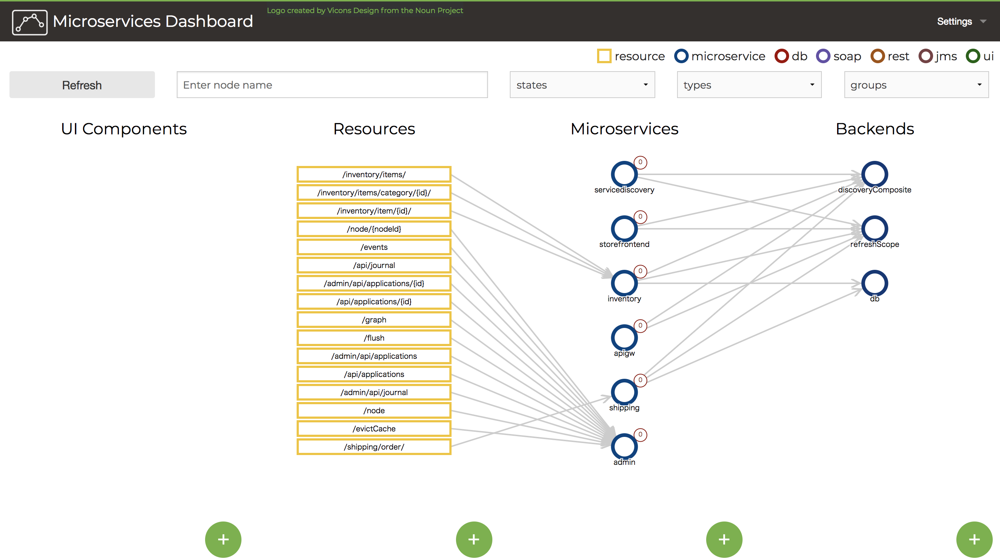
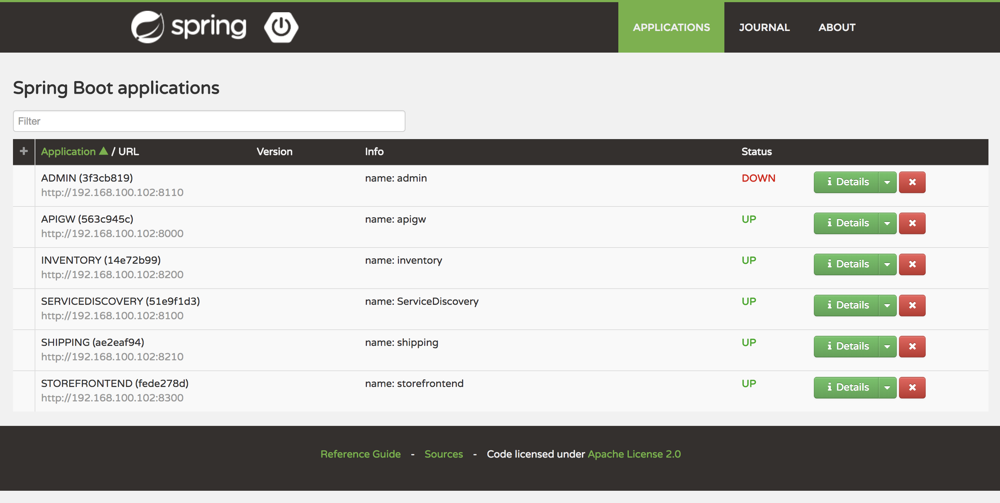

# spring-microservice-for-e-commerce
The example application is an e-commerce application which is based on Micro Service and Spring Cloud.

## Reference
http://microservices.io/patterns/microservices.html

## About the example application
This example application provides REST API for viewing and getting inventory item and saving shipping information.

## Stacks
- Spring Boot
- MyBatis
- Spring Cloud (Eureka, Ribon, and so on)
- Thymeleaf
- ...

## REST API specification of spring-microservice-for-e-commerce

### inventory application

- /inventory/items/
  + Gets all items.
- /inventory/items/category/{categoryId}
  + Gets items which belong to specify category.
- /inventory/items/{id}
  + Gets specify item.

If you specified invalid path (e.g. /inventory/iiiite, /inventory/items, /inventory/item/aaaa/) on browser or REST access,
this example application will be returned JSON message which includes an error infomation.

### shipping application.

- /shipping/order/
  + Order item with JSON message as follows.
  
```json
{  
   "item":[  
      {  
         "id":1,
         "unit":10
      }
   ],
   "senderName":"testSender",
   "receiverName":"testReceiver",
   "address":{  
      "zipCode":"123-4567",
      "location":"locloclocloc"
   }
}
```

### storefrontend application

TODO

### apigw application

TODO

### discovery application

TODO

### admin application

TODO

## How to run

### Run using Gradle command.
Run all application using Gradle command on spring-microservice-for-e-commerce directory.
```gradle
$spring-microservice-for-e-commerce> ./gradlew bootRun --parallel --max-workers=6
```

When you run Gradle command, there is a point to be mindful of.  
First, your pc must be online.  
If your pc is offline, Netflix products won't work.

### Spring Boot Admin

#### Microservice Dashboard

Please access 'http://localhost:8110'.



#### Spring Boot Admin

Please access 'http://localhost:8110/admin/'



### Microservices Dashboard


